[](https://classroom.github.com/a/HckmRrjT)
**Front End Programming**


# FEP1 Tentamen

***maandag 12 Juni 2023***

## Puntjes vooraf

- Open [deze MS-Teams bijeenkomst](https://teams.microsoft.com/l/meetup-join/19%3ameeting_YTE1YzJjYzItZmZmYy00NDk3LTk5YmEtNGMzM2YxNzc2ZmFk%40thread.v2/0?context=%7b%22Tid%22%3a%2298932909-9a5a-4d18-ace4-7236b5b5e11d%22%2c%22Oid%22%3a%22f85a4f5b-1753-4f36-9859-6c1330cbfc1b%22%7d) en hou in elk geval de chat van dit kanaal gedurende het tentamen open. We zullen dit kanaal enerzijds gebruiken om jullie te informeren mocht er iets met het tentamen zijn dat alle studenten betreft; maar we hopen niet dat dat nodig zal zijn. Anderzijds is dit het kanaal via welk jullie met ons in contact kunnen komen voor support vragen, als je op technische aspecten vastloopt.
We zullen dan in een privé meeting contact met je opnemen, maar kijk ook even naar de FAQ, want veel voorkomende vragen hebben we daar geprobeerd te beantwoorden. Gebruik dit chat kanaal echter niet voor discussie etc. Het is uitsluitend bedoeld om vragen aan ons te stellen (waarna we de vraag beantwoorden (in een privé meeting)), of om aanwijzingen van ons te kunnen ontvangen!!!!

- Zet een code assistent zoals CoPilot, ChatGTP, ... uit / gebruik deze niet. Om de verleiding of om de kans op plagiaat te verlagen willen we je tevens vragen om uit te loggen uit social media platformen zoals bijvoorbeeld Discord. Als we wel plagiaat constateren moeten we dit bij de examencommissie melden en die bestraffen dit zwaar met bijvoorbeeld uitsluiting van ALLE tentamens voor een blok of meerdere blokken!

- De reguliere tentamentijd voor dit tentamen is 2,5 uur. Op de GitHub server staat een deadline ingesteld. Na het verstrijken van de deadline kun je weliswaar nog steeds naar de repository pushen, maar we zullen pushes na de deadline niet meenemen in de beoordeling. We adviseren je om na elke opdracht je code te committen en te pushen.

- Aanpassingen aan de code dien je **uitsluitend** te beperken tot de functies / bestanden die in de opdracht genoemd worden. Aanpassingen aan andere functies / files dan in de opdracht vermeld zijn **niet** toegestaan en maken dat je punten in opdrachten mis zou kunnen lopen.

- Verder dien je geen nieuwe tools / libraries zoals bootstrap, jquery, lodash, moment.js etc aan het project toe te voegen.

TIP: De opdrachten hebben, indien niet anders vermeld, geen onderlinge afhankelijkheid. Sla een opdracht over als je vastloopt.

### De beoordeling

Bij elke opdracht staat aangegeven op welk lesonderdeel de opdracht betrekking heeft (JS, HTML, CSS en WEB). Voor elke opdracht scoor je een geheel cijfer (0-10) waarbij we in de beoordeling gebruik zullen maken van de volgende beoordelingsmatrix:

### Tabel Beoordelingsmatrix

| Onderdeel        | Waarde           | Opmerking  |
| ------------- |:-------------:| -----:|
| werkende opdracht      | 50% van het opdrachtcijfer | wordt altijd beoordeeld met werkt wel / niet |
| commentaar bij de opdracht      | 20% van het opdrachtcijfer      |   wordt altijd beoordeeld en moet ook bij de CSS en HTML opdrachten aanwezig zijn.|
| optimale code | 20% van het opdrachtcijfer      |    heb je bijvoorbeeld omslachtig geprogrammeerd en kon het efficiënter? Heb je rekening gehouden met uitzonderingen? Dit onderdeel wordt alleen beoordeeld als aan eerste twee onderdelen (werkende opdracht en commentaar) is voldaan. |
| kwaliteit | 10% van het opdrachtcijfer      |    Hier zijn de 2 documenten omtrent de coding standaards leidend (zoals het gebruik van CamelCase). Dit onderdeel wordt alleen beoordeeld als aan de eerste twee onderdelen is voldaan.|

| :information_source:   |  Wil je per opdracht een voldoende scoren,  dan moet die dus minimaal werken en van commentaar zijn voorzien!!!   | 
| ---- |-------------|

Het commentaar dient niet heel erg uitgebreid te zijn, maar moet ons duidelijk maken dat je door hebt wat je hebt gedaan en waarom je het zo hebt gedaan (geldt ook voor de HTML en CSS opdrachten!!!). Beschrijf hoe je het aan ons zou uitleggen als wij om uitleg vragen.

Met de examencommissie is afgestemd dat het ons vrij staat om bij verdenking (of twijfel) op plagiaat, de betreffende student(en) voor een gesprek uit te nodigen.

| :warning:   |  LET WEL: Indien we plagiaat constateren moeten we dit melden aan de examencommissie en daar staan zware sancties op!!!  | 
| ---- |-------------|

Dus weersta de verleiding om snel even iemand te vragen om je te helpen en maak de opdrachten zelf.

De opdrachten wegen niet allemaal even zwaar mee in het eindcijfer.
Het eindcijfer is het gemiddelde van de cijfers van alle opdrachten bij elkaar opgeteld, waarbij de JS & WEB opdrachten een gewicht van 2 hebben en de HTML en CSS opdrachten een gewicht van 1 (zodoende correspondeert dit met het aantal lesweken van dat onderwerp).
Je eindcijfer wordt dus als volgt berekend:

```text
  eindcijfer = (
      2 * SOM(opdracht cijfers JS opdrachten) / aantal JS opdrachten + 
      SOM (opdracht cijfers HTML opdrachten) / aantal HTML opdrachten + 
      SOM (opdracht cijfers CSS opdrachten) / aantal CSS opdrachten + 
      2 * SOM (opdracht cijfers WEB opdrachten 
      ) / aantal WEB opdrachten) / 6
```

# De applicatie

De applicatie waaraan jullie gaan werken is een database voor het verrijken (toevoegen van extra informatie) van photo's die gemaakt zijn door drie robots die op mars rondrijden (Mars Rovers). De Nasa stel alle foto's die door de rovers gemaakt worden ter beschikking via een API.

## Nasa API key

Voor het tentamen heb je de API key NIET per se nodig. Wij hebben een aantal van de API responses lokaal neergezet. Dat betekent dat je zonder API key alleen van de sol dates 1000 & 1001 gebruik kan maken! Wil je meerdere sol dates kunnen gebruiken dan is het leuk om wel een API key aan te vragen.

De API key kan je aanvragen via https://api.nasa.gov/, vul het formulier in en de key wordt in de mail naar je toegestuurd.

## Nasa API key aanvragen en invoeren

De API key kan je aanvragen via https://api.nasa.gov/, vul het formulier in en de key wordt in de mail naar je toegestuurd.

Je kan de API key invoeren in het bestand `./src/data/nasa-api-settings.js` op de plek waar nu staat YOUR_API_KEY_HERE

```javascript
export const nasaApiSettings ={
  "api-key": "YOUR_API_KEY_HERE"
}
```

Als je vervolgens in het bestand `.src/services/nasa-openapi-service.js` op regel 14 de boolean op true zet, dan werk je via de nasa api met jouw key:

```javascript
  // When true a valid API key is needed and the rover data will be retrieved from the API
  // When false the rover data will be fetched from a local file
  #fetchFromApi = false;
```

Alle photos die gemaakt zijn (en worden) door de Mars rovers Curiosity, Opportunity, and Spirit kan via deze API opvragen. Elke rover heeft een aantal cameras. De photos zijn per mars dag (sol date) opvraagbaar.

# De opdrachten

Zoals in de oefen opdrachten gebruikelijk Clone de repository, installeer de dependencies (`npm install`) en start de development web server (`npm run dev`).
In de browser zou je vervolgens het volgende moeten zien:

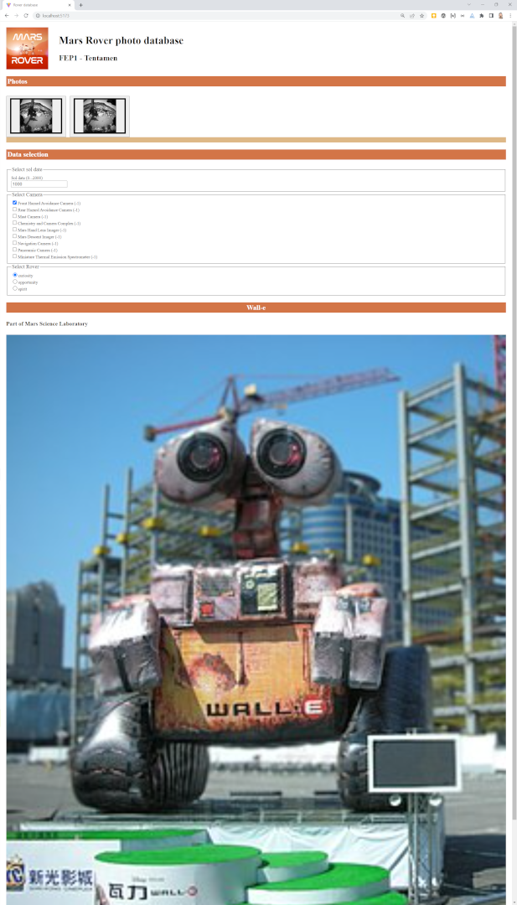

Maak nu de opdrachten die je hieronder kunt vinden. De kennen geen onderlinge afhankelijkheid / volgorde (met uitzondering van opdrachten die een A en B gedeelte kennen), maar ze wegen zo als boven beschreven niet allemaal even zwaar in de beoordeling.

| Type | Opdracht | Weging per opdracht |
| --- | --- | --- |
| CSS | Fundamentals | 1 |
| CSS | A11Y issues | 1 |
| CSS | Grid Layout | 1 |
| JS | Arrays | 2 |
| JS | Fetch / Promises A | 2 |
| JS | Fetch / Promises B | 2 |
| WEB | EventListener | 3 |
| WEB | DOM Manipulatie | 3 |
| HTML | Edit Page | 3 |

Geef bij elke file die je aanpast bovenin, in het commentaar, je naam en studentennummer.

## CSS Opdracht Fundamentals

Op de site vind je een afbeelding van een NASA rover (zie afbeelding; Wall-e is hier een placeholder afbeelding voor de nasa rovers).
Voeg aan het bestand `/styles.css` de css code toe die maakt dat de hoeken van de afbeelding worden afgerond (zie de tweede afbeelding van Wall-e), zonder dat je hiervoor wijzigingen aan de index.html aanbrengt. Maak via het commentaar in de CSS duidelijk wat je voor deze opdracht hebt toegevoegd / aangepast.

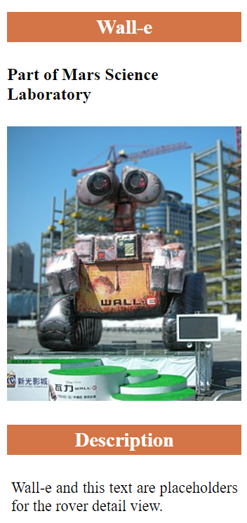
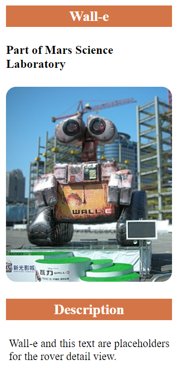

## CSS Opdracht A11Y issues

Als je de accessibility van de pagina met AXE test, zou je 2 fouten met betrekking tot het contrast moeten krijgen.
Verhelp deze issues door het bestand `styles.css` aan te passen. Maak via het commentaar in de CSS duidelijk wat je voor deze opdracht hebt toegevoegd / aangepast.

## CSS Opdracht Grid layout

Met de huidige layout is de site best onoverzichtelijk. Pas in het bestand `styles.css` de css van de `.grid-container` selector aan, zodat de site gebruikmaakt van een grid die een layout kent zoals weergegeven in deze schematische afbeelding en vervolgens op een desktop overzichtelijk wordt weergegeven:

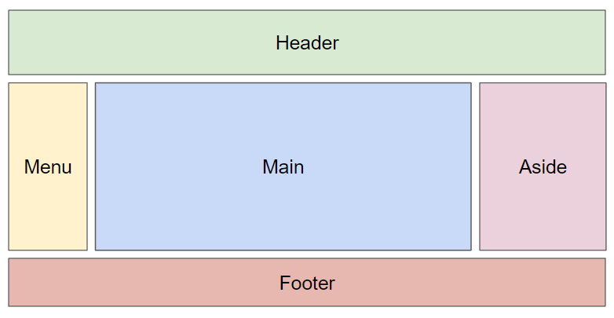

De breedte van de eerste kolom dien je hierbij in het eenheid `px` aan te geven, de eenheden voor de andere kolommen mag je zelf kiezen.
Het eindresultaat zou in de buurt moeten komen van deze afbeelding:
Vergeet niet ook hier commentaar aan je CSS toe te voegen die ons meeneemt in wat je hebt gedaan.

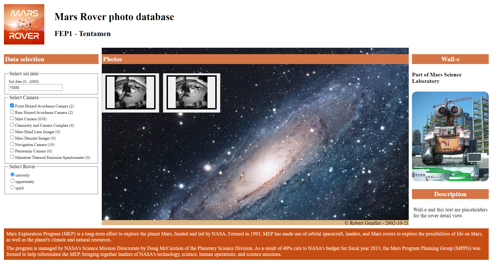

## JS Opdracht Arrays

In het menu gedeelte van de site vind je een aantal checkboxen om te selecteren van welke camera's van de geselecteerde rover je de photos wilt zien. Achter elke camera zou tussen haakjes het aantal beschikbare foto's van die camera moeten staan. Deze functionaliteit is echter nog niet af, vandaar dat er overal -1 staat.

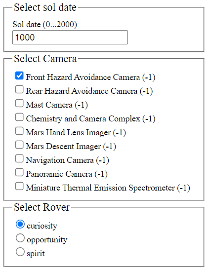

Pas in het bestand `/src/utils/nasa-openapi-utils.js` de functie `countByCamera` aan, zodat deze wel het correcte aantal afbeeldingen per camera weergeeft.
Vergeet ook hier niet met commentaar in de code toe te lichten wat je hebt gedaan.

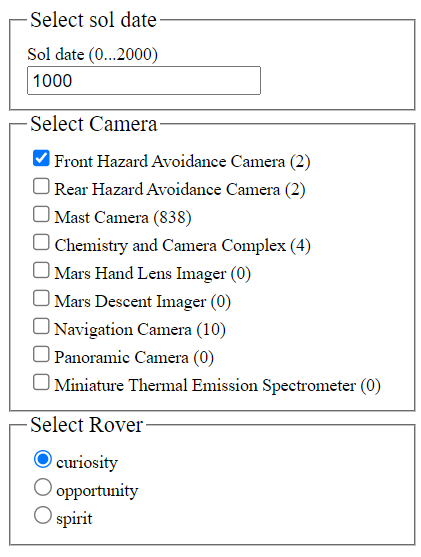

## JS Opdracht Fetch/Promises

### Opdracht A (Producer)

In het bestand `/src/service/nasa-openapi-service.js` vind je de methode `getAPOD`. De taak van deze methode is het ophalen van de json omtrent het astronomisch plaatje van de dag. Dit kan met de url 'https://api.nasa.gov/planetary/apod?api_key={Jouw-API-Key}&count=1'.

Het resultaat van deze methode zal een json object zijn zoals deze:
```json
[
  {
    "copyright": "Robert Gendler",
    "date": "2002-10-21",
    "explanation": "Andromeda is the nearest major galaxy to our own Milky Way Galaxy.  Our Galaxy is thought to look much like Andromeda.  Together these two galaxies dominate the Local Group of galaxies.  The diffuse light from Andromeda is caused by the hundreds of billions of stars that compose it.  The several distinct stars that surround Andromeda's image are actually stars in our Galaxy that are well in front of the background object.  Andromeda is frequently referred to as M31 since it is the 31st object on Messier's list of diffuse sky objects.  M31 is so distant it takes about two million years for light to reach us from there.  Although visible without aid, the above image of M31 is a digital mosaic of 20 frames taken with a small telescope.  Much about M31 remains unknown, including how the center acquired two nuclei.",
    "hdurl": "Andromeda_gendler_sm.jpg",
    "media_type": "image",
    "service_version": "v1",
    "title": "M31: The Andromeda Galaxy",
    "url": "Andromeda_gendler_s60.jpg"
  }
]
```

Het aantal keren dat je deze URL mag benaderen is echter erg beperkt (initieel ca 40 keer). Je zult dan ook erg snel een HTTP 429 error ontvangen, welke aangeeft dat jij de toegestaan limiet hebt overschreden. Mocht deze of een andere error zich voordoen dan moet de `getAPOD` methode het resultaat met een fetch bij de backup locatie ('../src/data/nasa-api-apod-cache.json') ophalen.

:warning:
[9-6-2023] Helaas hebben we moeten constateren dat er op dit moment door de NASA aan deze API gewerkt wordt. Dat maakt het dat je (waarschijnlijk) een foutmelding krijgt als je de APOD (Astronomical Picture of the Day) probeert op te halen.
Het is nog steeds aan jouw om zowel de API fetch, als de backup fetch te implementeren. De code moet eerst de API fetch uitvoeren en als deze een foutmelding geeft dan de backup fetch ('../src/data/nasa-api-apod-cache.json') uitvoeren.

### Opdracht B (Consumer)

Het resultaat van de `getAPOD` methode (opdracht A) zullen we voor de achtergrond van de main-tag gebruiken.

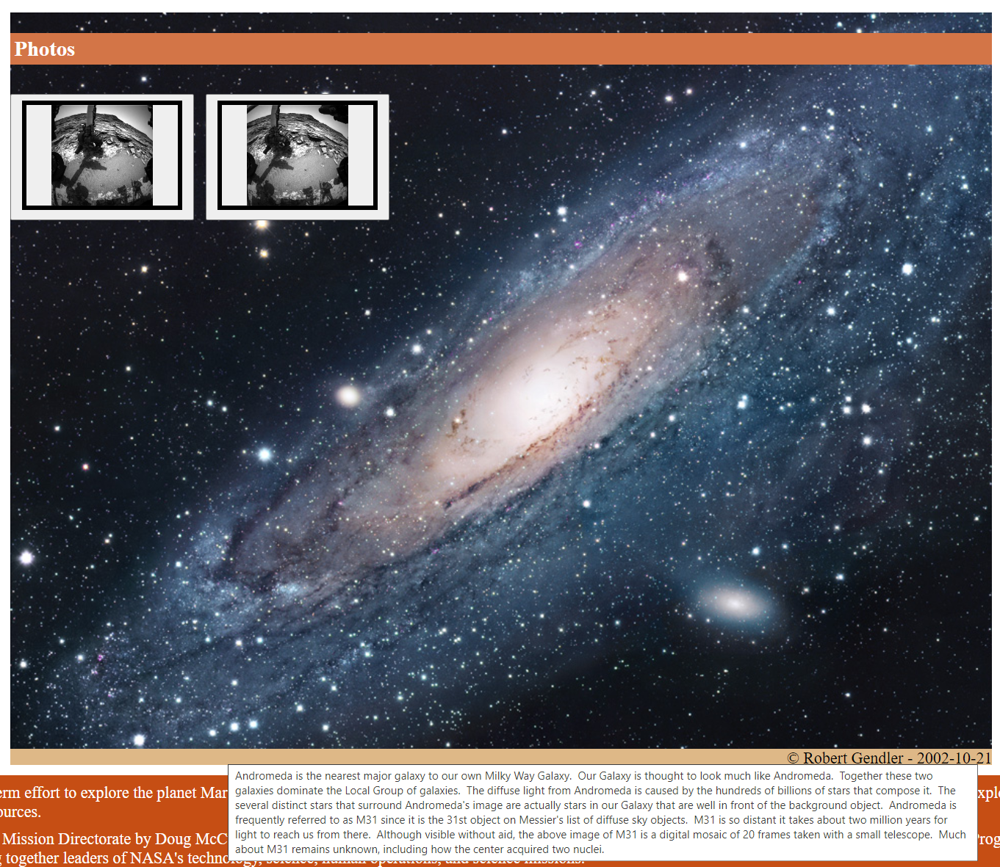

Echter er ontbreekt nog code in de `constructor` van de klasse `ApodBackground` van de file `/src/views/apod-background.js`. Die code dient met behulp van de `getAPOD` methode van de `nasa-openapi-service` de json op te halen en in het attribuut `apod` op te slaan. Hierna zou de render methode aangeroepen moeten worden, zodat de achtergrond en footer en titel goed gezet gaan worden.

Implementeer de constructor en zet er commentaar bij die je code toelicht.

## WEB Opdracht EventListener

Op dit moment worden standaard de afbeeldingen behorende tot de  default ingestelde sol date getoond. Als je dit bijvoorbeeld aanpast naar sol date 1001 heeft dit geen effect, wat het echter wel zou moeten hebben. Dit komt omdat er nog niet naar wijzigingen op het sol data input veld geluisterd wordt.
Voeg aan het einde van de `render` methode in het bestand `/src/views/sol-selection.js` code toe die maakt dat er bij het wijzigen van de sol date de `handleSolChange` methode aangeroepen wordt.

## WEB Opdracht DOM Manipulatie

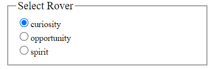

Het selecteren van een rover zou moeten maken dat in plaats van Wall-e de geselecteerde NASA rover getoond gaat worden. In de HTML code van het bestand `index.html` is er al voor elke rover een template met alle content voor die rover te vinden.

```html
    <template id="curiosity-detail-template">
      <h3>Curiosity</h3>
      ...
    </template>

    <template id="opportunity-detail-template">
      <h3>Opportunity</h3>
      ...
    </template>

    <template id="spirit-detail-template">
      <h3>Spirit</h3>
      ...
    </template>
```

Echter in de `render` methode in `/src/views/rovers-details` staat wel al een statement waarmee de id van de te tonen rover-template opgehaald wordt, maar voor de rest is de `render` methode nog niet af. Voeg code aan de render methode toe, die de inhoud van de te tonen rover-template op de in de html plaatst. De plek in de html waar de template geplaatst moet worden heeft de id `#rover-detail-view`. Let erop dat er altijd precies een enkele rover getoond wordt en dat jij commentaar bij je code hebt geplaatst.

## HTML Opdracht Edit Page

Onder aan het dialoogvenster van de photos die door de rover zijn gemaakt, zie je een link 'Edit meta data'. Deze link maakt dat de browser de html die je in `/public/pages/edit-meta-data.html` kunt vinden gaat laden.

Alleen deze HTML pagina is nog niet af. Het is de bedoeling dat deze pagina er als volgt uit komt te zien:

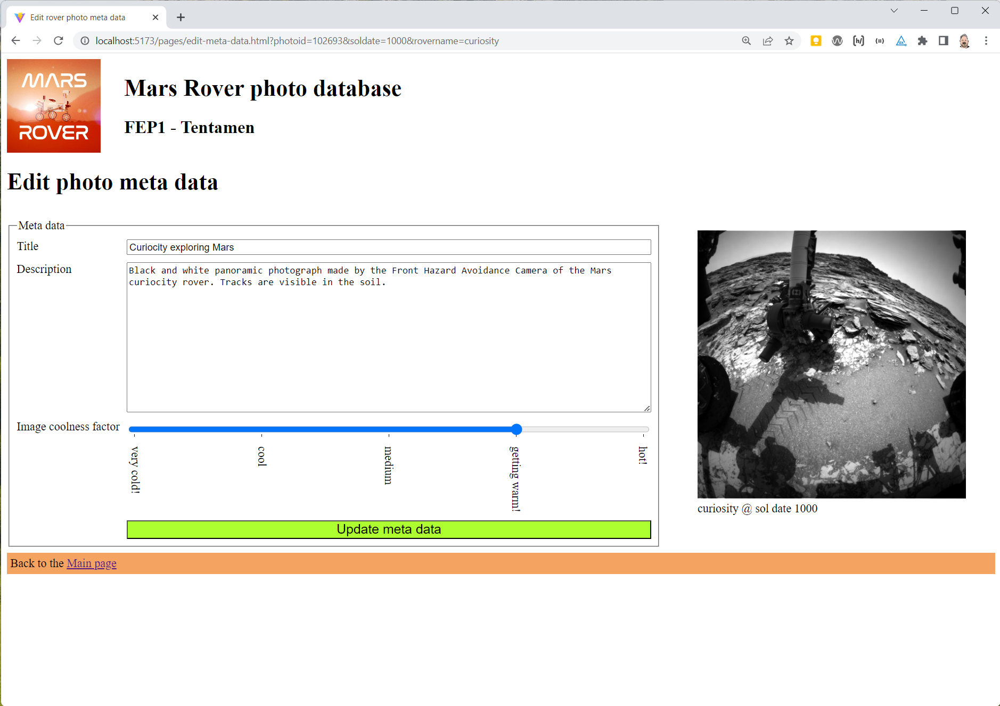

Verder is er met de mededevelopers die al de CSS en de JS code geschreven hebben afgesproken dat de volgende id's en classnamen gebruikt moeten worden.

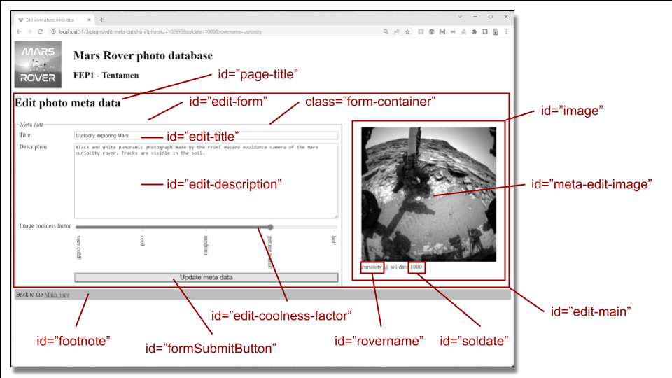

Geef de HTML code die zich aan deze naamgevingafspraak houdt, zonder dat je de CSS en/of JS code hiervoor gaat aanpassen. Zorg er verder voor dat je HTML code geen accessibility errors geeft en zoveel mogelijk passende semantische tags gebruikt.

# FAQ

## Hoe moet ik tentamen inleveren?

Als het goed is heb je dit tentamen (zoals we dat ook vanaf de eerste les met de oefeningen doen) gecloned (git clone …​). Dit maakt dat git weet waar je online repository staat. Om nu code online in te leveren moet je (in de terminal) een aantal stappen doorlopen:

- `git add *` om alle op dat moment gewijzigde files aan de volgende commit actie toe te voegen.

- `git commit -m "{commit message}"` om de gewijzigde bestanden aan de lokale repository toe te voegen of de wijzigingen lokaal op te slaan.

- `git push -u origin main` om alle commits van je locale repository naar de server te pushen. Controleer voor de zekerheid met de browser op je GitHub repository dat de wijzigingen er staan.

:warning: Je mag met meerdere branches werken. Let er wel op, dat alleen de code in de main branch wordt beoordeeld.

Voer deze acties geregeld uit, bijvoorbeeld na elke opdracht die je af hebt (no worries, je kunt je antwoorden met een volgende commit gewoon bijwerken als je ontdekt dat er toch nog iets niet goed was). Door regelmatig te committen & te pushen voorkom je stress, mocht je computer ineens aan het einde van het tentamen gek doen of crashen.
Aan deze classroom assignment repository is een deadline gekoppeld. Committen na de deadline is mogelijk (tot dat we jullie de rechten op deze repo ontnemen), maar wordt door classroom aangegeven als zijnde te laat ingeleverd.

## De site werkt ineens niet meer?

Open de console van de dev-tools van je browser. Wellicht zie je daar een error staan, die je eerder niet had. JavaScript stopt met het runnen als het errors tegenkomt die je niet afvangt en dat maakt dat je code niet meer werkt. Een veel voorkomend probleem is hierbij dat je IDE soms denkt dat je een import bent vergeten te specificeren en deze voor je in de code plaatst.

Bij twijfel of je imports goed zijn bekijk dan in Github de initiële versie van de file. Bij dit tentamen hoef je immers geen imports toe te voegen.
